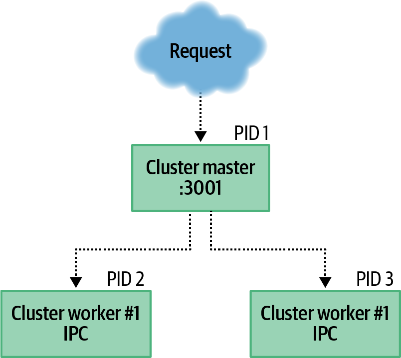
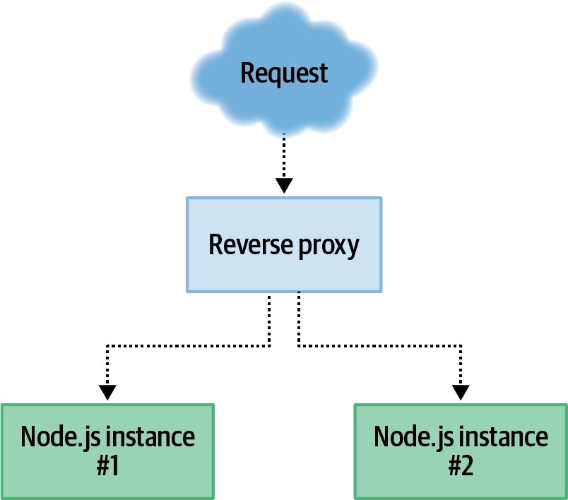
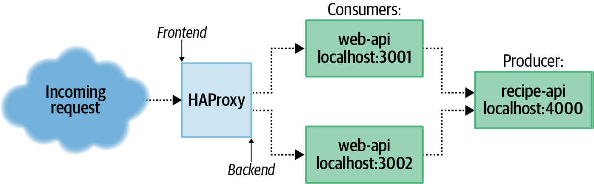
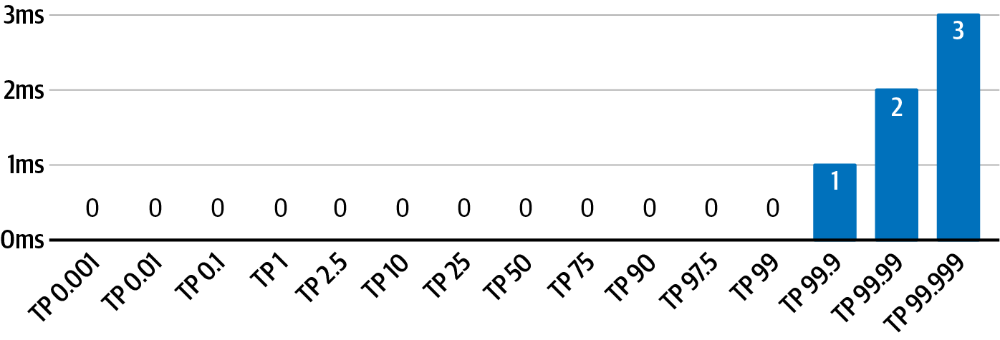

import { Link } from "gatsby"
import {
  Tip,
  Note,
  Caution,
  BorderBlock,
} from "../../../../src/components/html/block"

运行服务的冗余副本很重要，至少有两个原因。

第一个原因是为了实现高可用性。考虑到进程和整个机器偶尔会崩溃。如果只有一个生产者实例正在运行并且该实例崩溃，那么消费者将无法运行，直到崩溃的生产者重新启动。如果有两个或更多正在运行的生产者实例，一个实例生产者宕机后还有另外的生产者实例保持运行，保证消费者正常访问服务。

另一个原因是给定的 Node.js 实例只能处理固定的吞吐量。例如，根据硬件的不同，最基本的 Node.js Hello World 服务的吞吐量可能约为每秒 40,000 个请求 (r/s)。一旦应用程序开始序列化和反序列化有效负载或执行其他 CPU 密集型工作，吞吐量将下降几个数量级。将工作分配到多个子进程有助于防止单个进程不堪重负。

下面介绍一些方法，可用于帮助我们拆分工作。<Link to="#Cluster-模块">3.1 集群模块</Link>介绍了一个 NPM 的内置模块，该模块可以轻松地在同一台服务器上运行应用程序代码的多个副本。<Link to="../chapter-03/#使用-HAProxy-的反向代理">3.2 使用 HAProxy 的反向代理</Link>使用外部工具运行服务的多个冗余副本，允许它们运行在不同的机器上。最后，<Link to="../chapter-03/#SLA-和负载测试">3.3 SLA 和负载测试</Link>着眼于通过设置检查基准来了解服务可以处理的负载，基准可用于确定它应该扩展到的实例数量。

## Cluster 模块

Node.js 提供集群模块以允许在同一台机器上运行 Node.js 应用程序的多个副本，将传入的网络消息分派到这些副本。该模块类似于 child_process 模块，它提供了一个 fork() 方法，用于生成 Node.js 子进程；主要区别在于添加了路由传入请求的机制。

集群模块提供了一个简单的 API，任何 Node.js 程序都可以直接应用。因此，当应用程序需要扩展到多个实例时，它通常是下意识的解决方案。它变得有点无处不在，许多开源 Node.js 应用程序都依赖它。不幸的是，它也是一种**反模式(Anti-pattern)**，几乎从来都不是扩展流程的最佳工具。由于这种普遍性，有必要了解它是如何工作的，即使你应该经常避免它。

在 Cluster 模块的<a href="https://nodejs.org/api/cluster.html#cluster" refer="_black">官方文档</a>给出的例子中，加载 http 和 cluster 模块，并有一个 if 语句来查看脚本是否作为 master 运行，如果为 true，则生成一些子进程。否则，如果它不是主服务器，它会创建一个 HTTP 服务并开始监听。这个示例代码既存在一些风险又有点儿误导。

### 一个简单的例子

文档代码示例存在风险的原因是，它在父进程中加载了潜在的繁重和复杂的模块。它具有误导性的原因是，该示例并没有表明应用程序的多个单独实例正在运行并且不能共享全局变量之类的东西。由于这些原因，我们给出如下代码示例 3-1。

<div className="custom-code-title">
  示例 3-1 recipe-api/producer-http-basic-master.js
</div>

```javascript
// highlight-next-line
const cluster = require("cluster") // 1

console.log(`master pid=${process.pid}`)

cluster.setupMaster({
  // highlight-next-line
  exec: __dirname + "/producer-http-basic.js", // 2
})
// highlight-next-line
cluster.fork() // 3
cluster.fork()

cluster
  .on("disconnect", worker => {
    // highlight-next-line
    console.log("Worker disconnected.", worker.id) // 4
  })
  .on("exit", (worker, code, signal) => {
    console.log("Worker", worker.id, "exited.", code, signal)
    // highlight-next-line
    // cluster.fork() // 5
  })
  .on("listening", (worker, { address, port }) => {
    console.log("Worker", worker.id, `listening at ${address}:${port}`)
  })
```

1. 引入 cluster 模块
2. 重写生成子进程的默认入口 \_\_filename， 默认为文件自己本身
3. fork 方法创建一个子进程，例子中创建了两个
4. 事件监听
5. 在监听子进程退出的回调函数中注释掉该了 fork 方法，确保进程能轻易结束

`cluster` 的工作方式是主进程以一种**特殊的模式**生成子进程。在这种模式下，当一个 worker 进程试图监听一个端口时，它会向 master 发送一条消息。 监听端口的其实是 master 进程。 然后传入的请求被路由分发到到不同的子进程。如果任何子进程尝试在特殊端口 0（用于选择随机端口）上进行侦听，则主服务器将侦听一次，每个子进程将接收来自同一随机端口的请求。图 3-1 展示了这种夫进程和子进程关系。



不需要对之前完成的 recipe-api/producer-http-basic.js 代码做任何修改，只需要在父进程中提供需要生成的子进程文件的所在路径。下面来向该服务器发送一些请求，这次我们应该执行 recipe-api/producer-http-basic-**master**.js 文件而不是 recipe-api/producer-http-basic.js 文件。执行父进程后，可以得到如下输出：

```shell
master pid=4052
worker pid=4060
worker pid=4059
Producer running at http://127.0.0.1:4000
Producer running at http://127.0.0.1:4000
Worker 2 listening at 127.0.0.1:4000
Worker 1 listening at 127.0.0.1:4000
```

现在有三个正在运行的进程。可以通过运行以下命令来确认，其中 PID 替换为主进程的进程 ID，在我的情况下为 7649：

```shell
$ brew install pstree # 如果你用的是 macOS 系统，则需要另外安装
$ pstree <PID> -p -a
```

在我的 Linux 机器上运行时，得到的输出类似如下，由于路径过长，我简写了路径，不过这并不是关注点。

```shell
node,4052 recipe-api/producer-http-basic-master.js
  |-node,4059 /.../distributed-system-with-nodejs/recipe-api/producer-http-basic.js
  |   |-{node},4061
  |   |-{node},4062
  |   |-{node},4063
  |   |-{node},4064
  |   |-{node},4065
  |   └-{node},4071
  |-node,4060 /.../distributed-system-with-nodejs/recipe-api/producer-http-basic.js
  |   |-{node},4066
  |   |-{node},4067
  |   |-{node},4068
  |   |-{node},4069
  |   |-{node},4070
  |   └-{node},4072
  |-{node},4053
  |-{node},4054
  |-{node},4055
  |-{node},4056
  |-{node},4057
  └-{node},4058
```

如上输出可视化地展示了父进程，子进程以及两者之间的关系。如果在 Linux 机器上运行，它还会显示一些其他有趣的信息。另外注意到，三个进程中的每一个都在其下方显示了六个附加子条目，每个子条目都标记为 {node}，以及它们唯一的进程 ID。 这些条目表明底层 libuv 层中的多线程。 请注意，如果您在 macOS 上运行此程序，您将只会看到列出的三个 Node.js 进程。

### 调度请求

在 macOS 和 Linux 机器上，默认情况下，请求将被轮询分派给子进程。但在 Windows 系统上，请求将会最先分配给最空闲的子进程来处理。我们直接向 recipe-api 服务发出三个连续的请求，来观察一下这种情况。在此示例中，请求直接向 recipe-api 发出，因为这些更改不会影响 web-api 服务。 在另一个终端窗口中运行以下命令 3 次：

```shell
$ curl http://localhost:4000/recipes/42 # 执行 3 次
```

在输出中，您应该看到请求已在两个正在运行的工作实例之间循环：

```shell
worker request pid=4060
worker request pid=4059
worker request pid=4060
```

您可能还记得之前提到过的，示例 3-1 中的一些事件侦听器是在主进程，即 master.js 文件中创建的。 至此监听事件已经触发。下一步的操作将触发其他两个事件。当发出三个 HTTP 请求时，工作进程的 PID 值会显示在控制台中。然后结束掉其中的一个进程，看看会发生什么。选择其中一个 PID 并运行以下命令：

```shell
$ kill <pid>
```

在我的情况下，我运行了 kill 4060。然后主进程按顺序同时触发断开连接和退出事件。 您应该会看到类似于以下内容的输出：

```shell
disconnect 1
Worker 1 exited null SIGTERM
```

现在再次重复执行之前的三个 HTTP 请求：

```shell
$ curl http://localhost:4000/recipes/42 # 执行 3 次
```

这一次，每个响应都来自同一个剩余的子进程。如果我们在结束掉最后仅剩的一个子进程，将看到断开和退出事件被调用，然后主进程结束并退出。

请注意，在退出事件处理程序中有一个对 cluster.fork() 的注释调用。取消注释该行，再次启动主进程，并发出一些请求，并注意是哪个子进程的 PID 的值。 然后，运行 kill 命令停止其中一个子进程。 这时，主进程会立即再次启动子进程。 在这种情况下，结束一个子进程的唯一方法是结束掉主进程。

### Cluster 模块的缺点

Cluster 模块也并不是万金油，或是灵丹妙药。事实上，它通常更像是一种反模式。 通常情况下，应该使用另一个工具来管理 Node.js 进程的多个副本。 这样做通常有助于了解进程崩溃并允许您轻松扩展实例。 当然，您可以构建应用程序支持来增加和减少工作人员的数量，但这最好留给外部工具。这部分我们等到<Link to="../chapter-07/">第 7 章</Link>再讲。

该模块在应用程序受 CPU 绑定而不是 I/O 绑定的情况下最有用。这部分是因为 JavaScript 是单线程的，也因为 libuv 在处理异步事件方面非常有效。由于它将传入的请求传递给子进程的方式，它也相当的快。理论上，这比使用反向代理要快。

<Tip>

Node.js 应用程序可能会变得复杂。进程通常以数十个（如果不是数百个）模块结束，这些模块进行外部连接、消耗内存或读取配置。这些操作中的每一个都可能暴露应用程序中可能导致其崩溃的另一个弱点。

出于这个原因，最好让主进程尽可能简单。 示例 3-1 证明了 master 没有理由加载 HTTP 框架或是使用另一个数据库连接。可以在 master 中内置逻辑来重启失败的 worker，但 master 本身不能轻易重启。

</Tip>

Cluster 模块的另一个警告是，它本质上运行在第 4 层，在 TCP/UDP 级别运行，并且不一定了解第 7 层协议。为什么这很重要？例如，当一个传入的 HTTP 请求被发送到一个 master 和两个 worker 时，假设 TCP 连接在请求完成后关闭，那么每个后续请求都会被分派到不同的后端服务。 但是，通过 HTTP/2 上的 gRPC，这些连接有意保持打开的时间更长。 在这些情况下，未来的 gRPC 调用不会被分派到单独的工作进程，它们只会被一个子进程卡住。 发生这种情况时，您经常会看到一个子进程正在完成大部分工作，这样使用 Cluster 模块也就变得没有意义了。

粘性连接的问题可以通过修改之前在<Link to="../chapter-02#基于-RPC-的-gRPC">2.3 基于 RPC 的 gRPC</Link>一节中编写的代码来证明。通过让生产者和消费者代码完全相同，并通过引入示例 3-1 中的通用集群主节点， 问题浮出水面。 运行 producer master 和 consumer，向 consumer 发起多次 HTTP 请求，返回的 producer_data.pid 值始终相同。然后，停止并重新启动消费者。 这将导致 HTTP/2 连接停止并重新启动。然后集群的循环路由将消费者路由到其他工作人员。 再次向消费者发出几个 HTTP 请求，producer_data.pid 值现在将全部指向第二个工作者。

你不应该总是使用 Cluster 模块的另一个原因是它不是总会让应用程序变得更快。 在某些情况下，它甚至会消耗更多的资源，并且对应用程序的性能没有影响或产生负面影响。 例如，考虑一个进程仅限于单个 CPU 内核的环境。 如果您在 VPS（虚拟专用服务器）上运行，例如 AWS EC2 上提供的 t3.small 机器，则可能会发生这种情况。 如果进程在具有 CPU 限制的容器内运行，也可能发生这种情况，这可以在 Docker 中运行应用程序时进行配置。

速度变慢的原因是：当一个主 master 进程生成两个子 woker 进程时，共计有三个单线程的 JavaScript 实例在运行。 但是，只有一个 CPU 内核可用于一次运行每个实例。 这意味着操作系统必须做更多的工作来决定在任何给定时间运行三个进程中的哪一个。 诚然，主实例大部分时间都处于休眠状态，但两个工作人员会相互争夺 CPU 周期。

是时候从理论转向实践了。 首先，创建一个新文件来模拟执行 CPU 密集型工作的服务，使其成为与集群一起使用的候选对象。 该服务将根据输入数字简单地计算斐波那契值。 示例 3-2 是对此类服务的说明。

```javascript:title=示例 3-2 cluster-fibonacci.js
const server = require("fastify")

const HOST = process.env.HOST || "127.0.0.1"
const PORT = process.env.PORT || 4000

console.log(`worker pid=${process.pid}`)

// highlight-next-line
server.get("/:limit", async (req, res) => { // 1
  const limit = req.params.limit
  const result = fibonacci(limit)
  return String(result)
})

server.listen(PORT, HOST, () => {
  console.log(`Producer running at http://${HOST}:${PORT}`)
})

function fibonacci(limit) {
  // 2
  let prev = 1n,
    next = 0n,
    swap
  while (limit) {
    swap = prev
    prev = prev + next
    next = swap
    limit--
  }
  return next
}
```

1. 该服务有一个单一的路由 /:limit，其中 limit 是要计算的迭代次数。
2. fibonacci() 方法执行大量 CPU 密集型数学运算并阻止事件循环。

复制之前示例 3-1 中的代码可用作集群主控，并将其放在与 cluster-fibonacci.js 同目录的 master-fibonacci.js 文件中。 然后，修改以加载 cluster-fibonacci.js，而不是 producer-http-basic.js。

接下来要做的第一件事是针对斐波那契服务运行基准测试。 执行 master-fibonacci.js 文件，然后运行基准测试命令：

```shell
$ npm install -g autocannon@6                   # 控制台 1
$ node master-fibonacci.js                      # 控制台 2
$ autocannon -c 2 http://127.0.0.1:4000/100000  # 控制台 3
```

这将针对应用程序运行 Autocannon 基准测试工具（在第 76 页的“Autocannon 简介”中有更详细的介绍）。 它将以最快的速度在两个连接上运行 10 秒。 操作完成后，得到统计数据。

```table:title=Table 3-1 多核Fibonacci-cluster服务器测试结果
Running 10s test @ http://127.0.0.1:4000/100000
2 connections

┌─────────┬────────┬────────┬────────┬────────┬───────────┬──────────┬────────┐
│ Stat    │ 2.5%   │ 50%    │ 97.5%  │ 99%    │ Avg       │ Stdev    │ Max    │
├─────────┼────────┼────────┼────────┼────────┼───────────┼──────────┼────────┤
│ Latency │ 135 ms │ 166 ms │ 554 ms │ 568 ms │ 196.63 ms │ 93.26 ms │ 591 ms │
└─────────┴────────┴────────┴────────┴────────┴───────────┴──────────┴────────┘
┌───────────┬─────────┬─────────┬────────┬────────┬────────┬─────────┬─────────┐
│ Stat      │ 1%      │ 2.5%    │ 50%    │ 97.5%  │ Avg    │ Stdev   │ Min     │
├───────────┼─────────┼─────────┼────────┼────────┼────────┼─────────┼─────────┤
│ Req/Sec   │ 4       │ 4       │ 10     │ 13     │ 10.1   │ 2.67    │ 4       │
├───────────┼─────────┼─────────┼────────┼────────┼────────┼─────────┼─────────┤
│ Bytes/Sec │ 84.3 kB │ 84.3 kB │ 211 kB │ 274 kB │ 213 kB │ 56.1 kB │ 84.3 kB │
└───────────┴─────────┴─────────┴────────┴────────┴────────┴─────────┴─────────┘

Req/Bytes counts sampled once per second.

101 requests in 10.01s, 2.13 MB read
```

**需要关注的是平均延迟 196.63 ms，和平均每秒可处理请求 10.1 req/sec。**

接下来，结束掉 master-fibonacci.js 的主服务器，然后直接运行 cluster-fibonacci.js 文件。 再次运行与之前运行的完全相同的 autocannon 命令。 结果如下。

```table:title=Table 3-2 单线程Fibonacci-cluster服务器测试结果
Running 10s test @ http://127.0.0.1:4000/100000
2 connections

┌─────────┬────────┬────────┬────────┬────────┬───────────┬──────────┬────────┐
│ Stat    │ 2.5%   │ 50%    │ 97.5%  │ 99%    │ Avg       │ Stdev    │ Max    │
├─────────┼────────┼────────┼────────┼────────┼───────────┼──────────┼────────┤
│ Latency │ 109 ms │ 225 ms │ 364 ms │ 387 ms │ 228.85 ms │ 61.76 ms │ 387 ms │
└─────────┴────────┴────────┴────────┴────────┴───────────┴──────────┴────────┘
┌───────────┬────────┬────────┬────────┬────────┬────────┬─────────┬────────┐
│ Stat      │ 1%     │ 2.5%   │ 50%    │ 97.5%  │ Avg    │ Stdev   │ Min    │
├───────────┼────────┼────────┼────────┼────────┼────────┼─────────┼────────┤
│ Req/Sec   │ 8      │ 8      │ 9      │ 9      │ 8.6    │ 0.49    │ 8      │
├───────────┼────────┼────────┼────────┼────────┼────────┼─────────┼────────┤
│ Bytes/Sec │ 169 kB │ 169 kB │ 190 kB │ 190 kB │ 181 kB │ 10.3 kB │ 169 kB │
└───────────┴────────┴────────┴────────┴────────┴────────┴─────────┴────────┘

Req/Bytes counts sampled once per second.

86 requests in 10.01s, 1.81 MB read
```

**同样，关注平均延迟 228.85 毫秒，和平均每秒可处理请求 8.6 req/sec。**

在这种情况下，具有多个 CPU 内核的机器上，我可以看到通过运行 CPU 密集型 Fibonacci 服务的两个实例，多核要比单核更能处理更过的请求，访问延迟也相对较低。

接下来，我们将模拟一个只有一个 CPU 实例可用的环境。 这是通过使用 taskset 命令强制进程使用特定的 CPU 内核来完成的。 此命令在 macOS 上不存在，但您可以通过阅读了解它的要点。

再次运行 master-fibonacci.js 主文件。 请注意，服务的输出包括 master 的 PID 值，以及两个 worker。 记下这些 PID 值，然后在另一个终端中运行以下命令：

```shell
# 在 Linux 环境下运行如下命令：
$ taskset -cp 0 <pid> # 将 pid 换成 主线程、子进程1 和 子进程2 的 pid 各执行一次
```

最后，运行本节中使用的相同 autocannon 命令进行测试。得到的结果如下。

```table:title=Table 3-3 单核Fibonacci-cluster服务器测试结果
Running 10s test @ http://127.0.0.1:4000/100000
2 connections

┌─────────┬────────┬────────┬────────┬────────┬───────────┬──────────┬────────┐
│ Stat    │ 2.5%   │ 50%    │ 97.5%  │ 99%    │ Avg       │ Stdev    │ Max    │
├─────────┼────────┼────────┼────────┼────────┼───────────┼──────────┼────────┤
│ Latency │ 214 ms │ 232 ms │ 284 ms │ 285 ms │ 236.62 ms │ 17.13 ms │ 285 ms │
└─────────┴────────┴────────┴────────┴────────┴───────────┴──────────┴────────┘
┌───────────┬────────┬────────┬────────┬────────┬────────┬─────────┬────────┐
│ Stat      │ 1%     │ 2.5%   │ 50%    │ 97.5%  │ Avg    │ Stdev   │ Min    │
├───────────┼────────┼────────┼────────┼────────┼────────┼─────────┼────────┤
│ Req/Sec   │ 6      │ 6      │ 8      │ 10     │ 8.4    │ 1.12    │ 6      │
├───────────┼────────┼────────┼────────┼────────┼────────┼─────────┼────────┤
│ Bytes/Sec │ 126 kB │ 126 kB │ 169 kB │ 211 kB │ 177 kB │ 23.5 kB │ 126 kB │
└───────────┴────────┴────────┴────────┴────────┴────────┴─────────┴────────┘

Req/Bytes counts sampled once per second.

84 requests in 10.01s, 1.77 MB read
```

**平均延迟 236.62 毫秒，和平均每秒可处理请求 8.4 req/sec。**

综上可以得出，使用 cluster 模块，虽然工作线程比 CPU 内核多，但会导致应用程序运行速度比我在机器上只运行单个进程实例时运行得慢。

Cluster 模块的最大缺点是，它只能将传入的请求分发给运行在同一台机器上的其他的进程。下一小节将介绍另外一种方法，能够通过网络将请求分发给不同机器上的进程。

## 使用 HAProxy 的反向代理

反向代理，接受来自客户端的请求，将其转发到其他服务器，等待从服务器获取响应，再将其发送回客户端。 乍一看，这样的工具可能只是增加了不必要的网络跃点并增加了网络延迟，但它实际上为服务器提供了许多有用的功能。 反向代理通常在第 4 层（如 TCP）或第 7 层通过 HTTP 运行。

它提供的功能之一是**负载平衡(Load Balancing)**。 反向代理可以接受传入请求，并将其转发到多个服务器之一，然后再向客户端回复响应。 同样，这听起来像是无缘无故的额外跃点，因为客户端可以维护上游服务器列表并直接与特定服务器通信。 但是，请考虑组织可能运行多个不同的 API 服务器的情况。 组织不希望将选择使用哪个 API 实例的责任推给第三方消费者，例如通过 api9.example.org 公开 api1.example.org。 相反，消费者应该能够使用 api.example.org 并且他们的请求应该自动路由到适当的服务。 这个概念的示意图如图 3-2 所示。



在选择将传入请求路由到哪个后端服务时，反向代理可以采用几种不同的方法。 就像集群模块一样，循环通常是默认行为。 还可以根据当前服务最少请求的后端服务来分派请求。 它们可以随机分派，甚至可以根据初始请求的内容进行分派，例如存储在 HTTP URL 或 cookie 中的会话 ID（也称为粘性会话）。 而且，也许最重要的是，反向代理可以轮询后端服务以查看哪些是健康的，拒绝将请求分派给不健康的服务。

其他有益的功能包括清理或拒绝格式错误的 HTTP 请求（这可以防止 Node.js HTTP 解析器中的错误被利用）、记录请求以便应用程序代码不必这样做、添加请求超时以及执行 gzip 压缩和 TLS 加密。 反向代理的好处通常远大于对性能最关键的应用程序以外的所有应用程序的损失。 因此，您几乎应该总是在 Node.js 应用程序和 Internet 之间使用某种形式的反向代理。

### HAProxy 简介

HAProxy 是一个非常高性能的开源反向代理，适用于第 4 层和第 7 层协议。 它是用 C 编写的，旨在稳定并使用最少的资源，将尽可能多的处理卸载到内核。 与 JavaScript 一样，HAProxy 是事件驱动和单线程的。

HAProxy 的设置非常简单。 它可以通过发送一个大小约为 12 兆字节的二进制可执行文件来部署。 配置可以完全使用单个文本文件完成。

在开始运行 HAProxy 之前，您首先需要安装它。 附录 A 中提供了一些这样做的建议。否则，请随意使用您喜欢的软件安装方法在您的开发机器上安装 HAProxy（至少 v2）的副本。

HAProxy 提供了一个可选的 Web 仪表板，用于显示正在运行的 HAProxy 实例的统计信息。 创建一个 HAProxy 配置文件，该文件尚未执行任何实际的反向代理，而只是公开仪表板。 在您的项目文件夹中创建一个名为 haproxy/stats.cfg 的文件，并添加示例 3-3 中所示的内容。

Example 3-3. haproxy/stats.cfg

```
frontend inbound // 1
  mode http // 2
  bind localhost:8000
  stats enable // 3
  stats uri /admin?stats
```

1. 创建名为 inbound 的前端
2. 监听地址
3. 开启网页版本的仪表盘

创建该文件后，您现在可以执行 HAProxy。 在终端窗口中运行以下命令：

```bash
$ haproxy -f haproxy/stats.cfg
```

由于配置文件有点过于简单，您会在控制台中打印出一些警告。 这些警告将很快得到修复，但 HAProxy 将正常运行。 接下来，在 Web 浏览器中，打开以下 URL：

```shell
http://localhost:8000/admin?stats
```

此时，您将能够看到有关 HAProxy 实例的一些统计信息。 当然，目前还没有什么有趣的东西。 显示的唯一统计信息是针对单个前端的。 此时您可以刷新页面，传输的字节数会增加，因为仪表板还会测量对自身的请求。

HAProxy 的工作原理是创建前端（它侦听传入请求的端口）和后端（由主机标识的上游后端服务和将请求转发到的端口）。 下一节实际上创建了一个后端来路由传入的请求。

<BorderBlock>

<center>HAProxy 的替代品</center>

有很多替代反向代理可供考虑。 最受欢迎的一种是 Nginx。 就像 HAProxy 一样，它是一个开源工具，以二进制形式分发，可以使用单个配置文件轻松运行。 Nginx 能够执行负载平衡、压缩、TLS 终止以及 HAProxy 支持的许多其他功能。 它的显着不同之处在于它被归类为 Web 服务器——它能够将请求映射到磁盘上的文件，这是 HAProxy 中有意缺少的功能。 Nginx 还能够缓存响应。

在 AWS 上运行应用程序时，执行负载平衡和 TLS 终止的首选工具将是 ELB（弹性负载平衡）。 HAProxy 的其他功能，例如根据内容将请求路由到后端服务的能力，可以由 API Gateway 执行。

如果您只是在寻找一种开源解决方案来执行比 HAProxy 提供的更强大的路由，请考虑 Traefik 和 Kong Gateway。

</BorderBlock>

### 负载平衡和健康检查

本节启用 HAProxy 的负载平衡功能，并消除了示例 3-3 配置中的那些警告。 之前，您查看了组织应使用反向代理拦截传入流量的原因。 在本节中，您将配置 HAProxy 来做到这一点； 它将充当外部流量和 web-api 服务之间的负载平衡器，公开单个主机/端口组合，但最终提供来自两个服务实例的流量。 图 3-3 提供了一个可视化的表示。

从技术上讲，无需对应用程序进行更改即可使用 HAProxy 进行负载平衡。 但是，为了更好地展示 HAProxy 的功能，将添加一个称为健康检查的功能。 一个以 200 状态码响应的简单端点现在就足够了。 为此，请复制 web-api/consumer-http-basic.js 文件并添加一个新端点，如示例 3-4 所示。 第 120 页的“健康检查”将着眼于构建更准确的健康检查端点。



```javascript
server.get("/health", async () => {
  console.log("health check")
  return "OK"
})
```

您还需要一个新的 HAProxy 配置文件。 创建一个名为 haproxy/load-balance.cfg 的文件，并将示例 3-5 中的内容添加到其中。

```
defaults // 1
  mode http
  timeout connect 5000ms // 2
  timeout client 5000ms
  timeout server 5000ms

frontend inbound
  bind localhost:3000
  default_backend web-api // 3
  stats enable
  stats uri /admin?stats

backend web-api // 4
  option httpchk GET /health // 5
  server web-api-1 localhost:3001 check // 6
  server web-api-2 localhost:3002 check
```

1. 默认部分配置多个前端。
2. 添加了超时值，消除了 HAProxy 警告。
3. 一个前端可以路由到多个后端。 在这种情况下，应该只路由到 web-api 后端。
4. 第一个后端 web-api 已配置。
5. 此后端的运行状况检查发出 GET /health HTTP 请求。
6. web-api 将请求路由到两个后端，check 参数启用健康检查。

此配置文件指示 HAProxy 查找当前机器上运行的两个 web-api 实例。 为避免端口冲突，已指示应用程序实例侦听端口：3001 和：3002。 入站前端配置为侦听端口：3000，本质上允许 HAProxy 替代常规运行的 web-api 实例。

与第 53 页“集群模块”中的集群模块非常相似，请求在两个单独的 Node.js 进程之间循环路由 3。 但是现在需要维护的运行中的 Node.js 进程少了一个。 正如 host:port 组合所暗示的那样，这些进程不需要在 localhost 上运行，HAProxy 就可以转发请求。

现在您已经创建了配置文件并有了一个新的端点，是时候运行一些进程了。 对于此示例，您需要打开五个不同的终端窗口。 在四个不同的终端窗口中运行以下四个命令，并在第五个窗口中多次运行第五个命令：

```bash
$ node recipe-api/producer-http-basic.js
$ PORT=3001 node web-api/consumer-http-healthendpoint.js
$ PORT=3002 node web-api/consumer-http-healthendpoint.js
$ haproxy -f ./haproxy/load-balance.cfg

$ curl http://localhost:3000/ # 执行多次
```

请注意，在 curl 命令的输出中，consumer_pid 在两个值之间循环，因为 HAProxy 在两个 web-api 实例之间路由请求循环。 另外，请注意 producer_pid 值保持不变，因为只有一个 recipe-api 实例正在运行。

此命令命令首先运行相关程序。 在这种情况下，首先运行 recipe-api 实例，然后运行两个 web-api 实例，然后是 HAProxy。 一旦 HAProxy 实例运行，您应该会注意到 web-api 终端中的一些有趣的东西：健康检查消息被一遍又一遍地打印，每两秒一次。 这是因为 HAProxy 已开始执行健康检查。

通过访问 http://localhost:3000/admin?stats 再次打开 HAProxy 统计页面 4。 您现在应该在输出中看到两个部分：一个用于入站前端，另一个用于新的 web-api 后端。 在 web-api 部分，您应该会看到列出的两个不同的服务器实例。 他们俩都应该有绿色背景，表明他们的健康检查正在通过。 我得到的结果的截断版本如表 3-4 所示。

Table 3-4. Truncated HAProxy stats

```table
Sessions    total   Bytes out   LastChk
web-api-1   6       2,262       L7OK/200 in 1ms
web-api-2   5       1,885       L7OK/200 in 0ms
Backend     11      4,147
```

最后一行 Backend 表示其上方列的总数。 在此输出中，您可以看到请求在两个实例之间基本上平均分布。 通过检查 LastChk 列，您还可以看到运行状况检查正在通过。 在这种情况下，两台服务器都通过在 1 毫秒内返回 200 状态来通过 L7 健康检查 (HTTP)。

现在是时候用这个设置来找点乐子了。 首先，切换到运行 web-api 副本的终端之一。 按 Ctrl + C 停止该过程。然后，切换回统计网页并刷新几次。 根据您的速度，您应该会看到 web-api 部分中的一行从绿色变为黄色再变为红色。 这是因为 HAProxy 已确定服务已关闭，因为它不再响应健康检查。

现在 HAProxy 已确定服务已关闭，切换回第五个终端屏幕并运行更多 curl 命令。 请注意，尽管来自相同的 web-api PID，但您会不断收到响应。 由于 HAProxy 知道其中一项服务已关闭，因此它只会将请求路由到健康的实例。

切换回您杀死 web-api 实例的终端，重新启动它，然后切换回统计页面。 刷新几次，注意状态如何从红色变为黄色再变为绿色。 切换回 curl 终端，再运行几次命令，注意到 HAProxy 现在再次在两个实例之间分派命令。

乍一看，这个设置似乎运行得非常顺利。 你杀死了一个服务，它停止接收流量。 然后，你把它带回来，交通又恢复了。 但是你能猜到问题是什么吗？

早些时候，在运行 web-api 实例的控制台输出中，可以看到运行状况检查每两秒触发一次。 这意味着服务器可以关闭一段时间，但 HAProxy 还没有意识到这一点。 这意味着有一段时间请求仍然会失败。 为了说明这一点，首先重新启动死的 web-api 实例，然后从输出中选择一个 consumer_pid 值并替换以下命令中的 CONSUMER_PID：

```shell
$ kill <CONSUMER_PID> \
  && curl http://localhost:3000/ \
  && curl http://localhost:3000/
```

该命令的作用是杀死一个 web-api 进程，然后发出两个 HTTP 请求，速度如此之快，以至于 HAProxy 不应该有足够的时间知道发生了不好的事情。 在输出中，您应该看到其中一个命令失败，而另一个命令成功。

健康检查的配置可以比目前显示的多一点。 可以在服务器行末尾的检查标志之后指定其他标志值对。 例如，这样的配置可能如下所示： server ... check inter 10s fall 4. 表 3-5 描述了这些标志以及如何配置它们。

Table 3-5. HAProxy health check flags

```table
Flag      Type      Default   Description
inter     interval  2s        Interval between checks
fastinter interval  inter     Interval when transitioning states
downinter interval  inter     Interval between checks when down
fall      int       3         Consecutive healthy checks before being UP
rise      int       2         Consecutive unhealthy checks before being DOWN
```

尽管可以将健康检查配置为非常积极地运行，但仍然没有完美的解决方案来解决检测服务何时关闭的问题； 使用这种方法总是存在将请求发送到不健康服务的风险。 “幂等性和消息传递弹性”（第 284 页）着眼于此问题的解决方案，其中客户端被配置为重试失败的请求。

### 压缩

通过在包含 HAProxy 应该压缩的内容的特定后端设置额外的配置标志，可以使用 HAProxy 轻松配置压缩。 有关如何执行此操作的演示，请参见示例 3-6。

```
defaults
  mode http
  timeout connect 5000ms
  timeout client 50000ms
  timeout server 50000ms

frontend inbound
  bind localhost:3000
  default_backend web-api

backend web-api
  compression offload // 1
  compression algo gzip // 2
  compression type application/json text/plain // 3
  server web-api-1 localhost:3001
```

1. 防止 haproxy 将带有 acceptencoding 头部地请求发往后端
2. 开启 gzip 压缩，也支持其他压缩算法
3. 压缩 contenttype 头为 json 或 text/plain 的内容

此示例明确指出，仅应在 Content-Type 标头值为 application/json 的响应上启用压缩，这是两个服务一直在使用的，或者 text/plain，如果端点没有，则有时可以偷偷溜过去。 t 已正确配置。

就像示例 2-4 中的 gzip 压缩完全在 Node.js 中执行一样，HAProxy 也将仅在通过检查 Accept-Encoding 标头知道客户端支持它时才执行压缩。 要确认 HAProxy 正在压缩响应，请在单独的终端窗口中运行以下命令（在这种情况下，您只需要运行一个 web-api）：

```bash
$ node recipe-api/producer-http-basic.js
$ PORT=3001 node web-api/consumer-http-basic.js
$ haproxy -f haproxy/compression.cfg
$ curl http://localhost:3000
$ curl -H 'Accept-Encoding: gzip' http://localhost:3000/ | gunzip
```

使用 HAProxy 执行 gzip 压缩将比在 Node.js 进程中执行更高性能。 第 81 页的“HTTP 压缩”将测试它的性能。

### TLS 终止

由于许多原因，在集中位置执行 TLS 终止很方便。 一个很大的原因是不需要为更新证书的应用程序添加额外的逻辑。 也可以避免追查哪些实例具有过期的证书。 组织内的单个团队可以处理所有证书生成。 应用程序也不必产生额外的 CPU 开销。

也就是说，在此示例中，HAProxy 会将流量定向到单个服务。 其架构如图 3-4 所示。


HAProxy 的 TLS 终止相当简单，第 29 页“HTTPS / TLS”中介绍的许多相同规则仍然适用。 例如，所有证书生成和信任链概念仍然适用，并且这些证书文件遵循易于理解的标准。 一个区别是在本节中使用 .pem 文件，该文件包含 .cert 文件和 .key 文件的内容。 示例 3-7 是先前命令的修改版本。 它生成单个文件并将它们连接在一起。

<div className="custom-code-title">Example 3-7. Generating a .pem file</div>

```bash
$ openssl req -nodex -new -x509 \
  -keyout haproxy/private.eky \
  -out haproxy/certificate.cert
$ cat haproxy/certificate.cert haproxy/private.key \
  > haproxy/combined.pem
```

现在需要另一个 HAProxy 配置脚本。 示例 3-8 将入站前端修改为通过 HTTPS 侦听并加载 combine.pem 文件。

<div className="custom-code-title">Example 3-8. haproxy/tls.cfg</div>

```
defaults
  mode http
  timeout connect 5000ms
  timeout client 50000ms
  timeout server 50000ms

global // 1
  tune.ssl.default-dh-param 2048

frontend inbound
  bind localhost:3000 ssl crt haproxy/combined.pem // 2
  default_backend web-api

backend web-api
  server web-api-1 localhost:3001
```

1. global 部分配置全局 HAProxy 设置。
2. ssl 标志指定前端使用 TLS，crt 标志指向 .pem 文件。

全局部分允许全局 HAProxy 配置。 在这种情况下，它设置客户端使用的 Diffie-Hellman 密钥大小参数并防止 HAProxy 警告。

现在您已经配置了 HAProxy，继续使用这个新的配置文件运行它，然后向它发送一些请求。 在四个单独的终端窗口中运行以下命令：

```bash
$ node recipe-api/producer-http-basic.js
$ PORT=3001 node web-api/consumer-http-basic.js
$ haproxy -f haproxy/tls.cfg
$ curl --insecure https://localhost:3000/
```

由于 HAProxy 使用的是自签名证书，因此 curl 命令再次需要 --insecure 标志。 举一个真实的例子，因为 HTTPS 流量是面向公众的，所以您需要使用像 Let's Encrypt 这样的真实证书颁发机构来为您生成证书。 Let's Encrypt 附带一个名为 certbot 的工具，可以将其配置为在证书过期之前自动更新证书，以及动态重新配置 HAProxy 以使用更新的证书。 配置 certbot 超出了本书的范围，并且有关于如何做到这一点的文献。

关于 HAProxy 中的 TLS，还有许多其他选项可以配置。 它允许指定要使用的密码套件、TLS 会话缓存大小和 SNI（服务器名称指示）。 单个前端可以为标准 HTTP 和 HTTPS 指定端口。 HAProxy 可以将发出 HTTP 请求的用户代理重定向到等效的 HTTPS 路径。

使用 HAProxy 执行 TLS 终止可能比在 Node.js 进程中执行的性能更高。 第 83 页的“TLS 终止”将测试此声明。

### 限速和背压

第 75 页的“SLA 和负载测试”着眼于确定 Node.js 服务可以处理多少负载的方法。 本节着眼于实施这种限制的方法。

默认情况下，Node.js 进程将“处理”接收到的请求数。 例如，当接收到请求时创建带有回调的基本 HTTP 服务器时，这些回调将继续由事件循环调度并尽可能调用。 但是，有时这可能会使流程不堪重负。 如果回调正在执行大量阻塞工作，那么安排太多的回调将导致进程锁定。 更大的问题是内存消耗。 每个排队的回调都带有一个新的函数上下文，其中包含变量和对传入请求的引用。 有时最好的解决方案是减少 Node.js 进程在给定时间处理的并发连接数量。

一种方法是设置 http.Server 实例的 maxConnections 属性。 通过设置此值，Node.js 进程将自动丢弃任何会使连接计数增加到大于此限制的传入连接。

npm 上每个流行的 Node.js HTTP 框架都会公开它使用的 http.Server 实例，或者提供一种方法来覆盖该值。 但是，在本例中，构建了一个使用内置 http 模块的基本 HTTP 服务器。

创建一个新文件并将示例 3-9 的内容添加到其中。

Example 3-9. low-connections.js

```javascript
const http = require("http")

const server = http.createServer((req, res) => {
  console.log("current conn", server._connections)
  setTimeout(() => res.end("OK"), 10_000)
})

server.maxConnections = 2
server.listen(3020, "localhost")
```

1. 这个 setTimeout() 模拟慢速异步活动，如数据库操作。
2. 最大传入连接数设置为 2。

该服务器模拟一个缓慢的应用程序。 在收到响应之前，每个传入请求需要 10 秒才能运行。 这不会模拟一个 CPU 使用率很高的进程，但它确实模拟了一个速度慢到可能压倒 Node.js 的请求。

接下来，打开四个终端窗口。 在第一个中，运行 low-connections.js 服务。 在其他三个中，使用 curl 命令发出相同的 HTTP 请求。 您需要在 10 秒内运行 curl 命令，因此您可能需要先粘贴该命令 3 次，然后执行它们：

```shell
$ node low-connections.js # terminal 1
$ curl http://localhost:3020/ # terminals 2-4
```

假设您运行命令足够快，前两个 curl 调用应该运行，尽管速度很慢，暂停 10 秒，然后最终将消息 OK 写入终端窗口。 然而，第三次运行时，该命令应该会写入错误并且会立即关闭。 在我的机器上，curl 命令打印 curl: (56) Recv failure: Connection reset by peer。 同样，服务器终端窗口不应写入有关当前连接数的消息。

server.maxConnections 值对该特定服务器实例的请求数量设置了硬性限制，Node.js 将丢弃任何超过该限制的连接。

这听起来可能有点刺耳！ 作为使用服务的客户端，更理想的情况可能是让服务器排队请求。 幸运的是，可以将 HAProxy 配置为代表应用程序执行此操作。 使用示例 3-10 中的内容创建一个新的 HAProxy 配置文件。

Example 3-10. haproxy/backpressure.cfg

```
defaults
  maxconn 8 // 1
  mode http

frontend inbound
  bind localhost:3010
  default_backend web-api

backend web-api
  option httpclose // 2
  server web-api-1 localhost:3020 maxconn 2 // 3
```

1. 最大连接数可以全局配置。 这包括传入的前端和传出的后端连接。
2. 强制 HAProxy 关闭与后端的 HTTP 连接。
3. 可以为每个后端服务实例指定最大连接数。

此示例设置了一个全局标志 maxconn 8。这意味着在所有前端和后端组合之间，只能同时运行 8 个连接，包括对管理界面的任何调用。 通常你会想要将它设置为一个保守的值，如果你使用它的话。 然而，更有趣的是附加到特定后端实例的 maxconn 2 标志。 这将是此配置文件的真正限制因素。

另外，请注意选项 httpclose 在后端设置。 这是为了让 HAProxy 立即关闭与服务的连接。 保持这些连接保持打开不一定会减慢服务速度，但这是必需的，因为应用程序中的 server.maxConnections 值仍设置为 2； 在连接保持打开状态的情况下，服务器将丢弃新连接，即使回调已完成与先前请求的触发。

现在，使用新的配置文件，继续运行相同的 Node.js 服务，使用该配置的 HAProxy 实例，然后再次并行运行 curl 请求的多个副本：

```shell
$ node low-connections.js # terminal 1
$ haproxy -f haproxy/backpressure.cfg # terminal 2
$ curl http://localhost:3010/ # terminals 3-5
```

同样，您应该看到前两个 curl 命令成功地在服务器上启动了一条日志消息。 但是，这一次第三个 curl 命令并没有立即关闭。 相反，它会等到前面的命令之一完成并且连接关闭。 一旦发生这种情况，HAProxy 就会意识到它现在可以自由地发送一个额外的请求，并且第三个请求被发送，导致服务器记录另一条关于有两个并发请求的消息：

```
current conn 1
current conn 2
current conn 2
```

当消费服务的请求排队时，就会产生背压，就像现在这里发生的那样。 如果消费者连续触发请求，生产者侧产生的背压将导致消费者减速。

通常只在反向代理中强制执行限制就可以了，而不必在应用程序本身中强制执行限制。 但是，根据您的体系结构的实现方式，可能是单个 HAProxy 实例以外的源能够向您的服务发送请求。 在这些情况下，在 Node.js 进程中设置更高的限制，然后在反向代理中设置更保守的限制可能是有意义的。 例如，如果您知道您的服务将在 100 个并发请求时停止，则可能将 server.maxConnections 设置为 90 并将 maxconn 设置为 80，根据您感觉的危险程度调整边距。

现在您知道如何配置最大连接数，是时候研究确定服务实际可以处理多少连接的方法了。

## SLA 和负载测试

软件即服务 (SaaS) 公司为其用户提供在线服务。 现代用户的期望是此类服务 24/7 可用。 试想一下，如果 Facebook 从下午 2 点开始在星期五不可用，那将是多么奇怪。 到下午 3 点 企业对企业 (B2B) 公司通常有更严格的要求，通常与合同义务相结合。 当组织出售对 API 的访问权时，通常有合同条款规定组织不会在没有充分通知升级的情况下进行向后破坏性更改，服务将全天候可用，并且请求将在 指定的时间跨度。

此类合同要求称为服务水平协议 (SLA)。 有时公司会在线提供它们，例如亚马逊计算服务水平协议页面。 有时他们是根据每个客户进行协商的。 可悲的是，它们通常根本不存在，性能没有被优先考虑，工程师在客户投诉单到达之前无法解决这些问题。

SLA 可能包含多个服务级别目标 (SLO)。 这些是组织对客户做出的 SLA 中的个别承诺。 它们可以包括正常运行时间要求、API 请求延迟和故障率等内容。 在衡量服务正在实现的实际价值时，这些被称为服务水平指标 (SLI)。 我喜欢将 SLO 视为分子，将 SLI 视为分母。 SLO 可能是 API 应该在 100 毫秒内响应，而 SLI 可能是 API 确实在 83 毫秒内响应。

本节着眼于确定 SLO 的重要性，不仅对组织而且对个人服务也是如此。 它着眼于定义 SLO 的方法以及通过运行一次性负载测试（有时称为基准测试）来衡量服务性能的方法。 稍后，第 102 页的“使用 Graphite、StatsD 和 Grafana 的指标”介绍了如何持续监控性能。

在定义 SLA 应该是什么样子之前，您将首先查看一些性能特征以及如何衡量它们。 为此，您将对之前构建的一些服务进行负载测试。 这应该让您熟悉负载测试工具以及在没有业务逻辑的情况下期望什么样的吞吐量。 一旦你熟悉了，测量你自己的应用程序应该会更容易。

### 简介 Autocannon

这些负载测试使用 Autocannon。 有很多替代方案，但这个既易于安装（它是一条 npm 命令），又能显示详细的统计信息。

<Caution>

随意使用您最熟悉的任何负载测试工具。 但是，切勿将一种工具的结果与另一种工具的结果进行比较，因为相同服务的结果可能会有很大差异。 尝试在整个组织中标准化相同的工具，以便团队可以一致地就绩效进行沟通。

</Caution>

Autocannon 以 npm 包的形式提供，它恰好提供了请求统计的直方图，这是衡量性能时非常重要的工具。 通过运行以下命令安装它（请注意，如果您遇到权限错误，您可能需要在它前面加上 sudo）：

```shell
$ npm install -g autocannon@6
```

<BorderBlock>

<center>Autocannon的替代品</center>

有许多用于运行 HTTP 负载测试的命令行工具。 由于 Autocannon 需要安装 Node.js 和 npm，因此多语言组织可能难以标准化，因为其他工具可作为本机二进制文件使用，并且更易于安装。

一些比较流行的工具包括 Apache Bench (ab)、wrk 和 Siege。 这些通常可以通过操作系统包管理器获得。

Gil Tene 有一个演讲，“如何不测量延迟”，他在其中讨论了大多数负载测试工具的常见缺点。 他的 wrk2 工具试图解决此类问题并提供高度准确的负载测试结果。 Autocannon 的灵感来自 wrk2。

</BorderBlock>

### 运行基线负载测试

这些负载测试将主要运行您已经在示例/文件夹中创建的应用程序。 但首先，您将熟悉 Autocannon 命令并通过对一些非常简单的服务进行负载测试来建立基线。 第一个将是一个普通的 Node.js HTTP 服务器，下一个将使用一个框架。 在这两种情况下，都会使用一个简单的字符串作为回复。

<Caution>

请务必禁用在请求处理程序中运行的任何 console.log() 语句。 尽管这些语句在实际工作的生产应用程序中提供了微不足道的延迟，但它们显着减慢了本节中的许多负载测试。

</Caution>

对于第一个示例，创建一个名为 benchmark/ 的新目录，并在其中创建一个包含示例 3-11 中的内容的文件。 这个普通的 HTTP 服务器将作为最基本的负载测试。

Example 3-11. benchmark/native-http.js

```javascript
const HOST = process.env.HOST || "127.0.0.1"
const PORT = process.env.PORT || 4000

require("http")
  .createServer((req, res) => {
    res.end("ok")
  })
  .listen(PORT, () => {
    console.log(`Producer running at http://${HOST}:${PORT}`)
  })
```

理想情况下，所有这些测试都将在具有与生产服务器相同功能的未使用服务器上运行，但为了学习，在本地开发笔记本电脑上运行它就可以了。 请记住，您在本地获得的数字不会反映您在生产中获得的数字！

运行该服务，并在另一个终端窗口中运行 Autocannon 以启动负载测试：

```shell
$ node benchmark/native-http.js
$ autocannon -d 60 -c 10 -l http://localhost:4000/
```

此命令使用三个不同的标志。 -d 标志代表持续时间，在这种情况下，它被配置为运行 60 秒。 -c 标志表示并发连接数，这里配置为使用 10 个连接。 -l 标志告诉 Autocannon 显示详细的延迟直方图。 要测试的 URL 是命令的最后一个参数。 在这种情况下，Autocannon 只是发送 GET 请求，但它可以配置为发出 POST 请求并提供请求正文。

表 3-6 到 3-8 包含我的结果。

```table
Table 3-6. Autocannon request latency
Stat 2.5% 50% 97.5% 99% Avg Stdev Max
Latency 0ms 0ms 0ms 0ms 0.01ms 0.08ms 9.45ms
```

第一个表包含有关延迟的信息，或者在发送请求后接收响应所需的时间。 如您所见，Autocannon 将延迟分为四个桶。 2.5% 的桶代表相当快的请求，50% 是中值，97.5% 是较慢的结果，99% 是最慢的，Max 列代表最慢的请求。 在此表中，较低的结果更快。 到目前为止的数字都太小了，以至于还不能做出决定。

```table
Table 3-7. Autocannon request volume
Stat 1% 2.5% 50% 97.5% Avg Stdev Min
Req/Sec 29,487 36,703 39,039 42,751 38,884.14 1,748.17 29,477
Bytes/Sec 3.66 MB 4.55 MB 4.84 MB 5.3 MB 4.82 MB 217 kB 3.66 MB
```

第二个表提供了一些不同的信息，即每秒发送到服务器的请求数。 在此表中，数字越大越好。 此表中的标题与上表中的对立面相关； 例如，1% 列与 99% 列相关。

这张表中的数字更有趣。 他们描述的是，服务器平均每秒能够处理 38,884 个请求。 但平均值并没有太大用处，这不是工程师应该依赖的数字吗？

考虑到通常情况下，来自用户的一个请求可能会导致向给定服务发送多个请求。 例如，如果用户打开一个网页，其中列出了根据他们的前 10 个食谱他们应该储存哪些成分，则该请求可能会生成 10 个对食谱服务的请求。 整个用户请求的缓慢会因后端服务请求的缓慢而加剧。 因此，在报告服务速度时，选择更高的百分位数非常重要，例如 95% 或 99%。 这被称为最高百分位数，在传达吞吐量时缩写为 TP95 或 TP99。

在这些结果的情况下，可以说 TP99 的延迟为 0 毫秒，或每秒 29,487 个请求的吞吐量。

第三个表是提供 -l 标志的结果，包含更细化的延迟信息。

```table
Table 3-8. Autocannon detailed latency results
Percentile Latency Percentile Latency Percentile Latency
0.001% 0ms 10% 0ms 97.5% 0ms
0.01% 0ms 25% 0ms 99% 0ms
0.1% 0ms 50% 0ms 99.9% 1ms
1% 0ms 75% 0ms 99.99% 2ms
2.5% 0ms 90% 0ms 99.999% 3ms
```

倒数第二行说明 99.99% 的请求（四个 9）将在至少 2 毫秒内得到响应。 最后一行说明 99.999% 的请求将在 3 毫秒内得到响应。

然后可以将这些信息绘制成图表，以更好地传达正在发生的事情，如图 3-5 所示。



同样，由于这些低数字，结果还没有那么有趣。

根据我的结果，我可以确定，假设 TP99，我可以从使用这个特定版本的 Node.js 和这个特定硬件的 Node.js 服务获得的绝对最佳吞吐量大约是 25,000 r/s（经过一些保守的四舍五入后） . 然后，试图实现高于该值的任何东西都是愚蠢的。

事实证明，25,000 r/s 实际上是相当高的，而且您很可能永远不会遇到需要从单个应用程序实例实现这样的吞吐量的情况。 如果您的用例确实需要更高的吞吐量，您可能需要考虑其他语言，例如 Rust 或 C++。

### 有关反向代理

之前我声称在反向代理中执行某些操作，特别是 gzip 压缩和 TLS 终止，通常比在正在运行的 Node.js 进程中执行它们更快。 负载测试可用于查看这些声明是否属实。

这些测试在同一台机器上运行客户端和服务器。 要准确地对您的生产应用程序进行负载测试，您需要在生产环境中进行测试。 这里的目的是衡量 CPU 影响，因为 Node.js 和 HAProxy 生成的网络流量应该是相等的。

#### 建立基线

但首先，需要建立另一个基线，并且必须面对一个不可避免的事实：引入反向代理必须至少增加一点延迟。 为了证明这一点，请使用与之前相同的 benchmark/native-http.js 文件。 但是，这一次您将在其前面放置最低配置的 HAProxy。 使用示例 3-12 中的内容创建一个配置文件。

Example 3-12. haproxy/benchmark-basic.cfg

```
defaults
  mode http

frontend inbound
  bind localhost:4001
  default_backend native-http

backend native-http
  server native-http-1 localhost:4000
```

在一个终端窗口中运行服务，在第二个终端窗口中运行 HAProxy，然后在第三个终端窗口中运行相同的 Autocannon 负载测试：

```shell
$ node benchmark/native-http.js
$ haproxy -f haproxy/benchmark-basic.cfg
$ autocannon -d 60 -c 10 -l http://localhost:4001
```

我得到的结果如图 3-6 所示。 TP99 吞吐量为 19,967 r/s，下降 32%，最大请求耗时 28.6ms。

与之前的结果相比，这些结果可能看起来很高，但请记住，应用程序并没有做太多的工作。 一个请求的 TP99 延迟，无论是在添加 HAProxy 之前还是之后，仍然小于 1ms。 如果一个真实的服务需要 100ms 响应，HAProxy 的加入增加了不到 1% 的响应时间。


#### HTTP 压缩测试

接下来的两个测试需要一个简单的直通配置文件。 此配置将使 HAProxy 简单地将请求从客户端转发到服务器。 配置文件有一个 mode tcp 行，这意味着 HAProxy 本质上将充当 L4 代理而不检查 HTTP 请求。

拥有 HAProxy 可确保基准测试将处理从 Node.js 卸载到 HAProxy 的效果，而不是额外网络跃点的效果。 使用示例 3-13 中的内容创建一个 haproxy/passthru.cfg 文件。

Example 3-13. haproxy/passthru.cfg

```
defaults
  mode tcp
  timeout connect 5000ms
  timeout client 50000ms
  timeout server 50000ms

frontend inbound
  bind localhost:3000
  default_backend server-api

backend server-api
  server server-api-1 localhost:3001
```

现在您可以衡量执行 gzip 压缩的成本。 这里不比较压缩与不压缩。 （如果这是目标，那么测试绝对需要在不同的机器上进行，因为收益是减少了带宽。）相反，比较了在 HAProxy 和 Node.js 中执行压缩的性能。

使用在示例 2-4 中创建的相同 server-gzip.js 文件，但您需要注释掉 console.log 调用。 还将使用在示例 3-6 中创建的相同 haproxy/compression.cfg 文件，以及您刚刚从示例 3-13 创建的 haproxy/passthru.cfg 文件。 对于此测试，您需要停止 HAProxy 并使用不同的配置文件重新启动它：

```shell
$ rm index.html ; curl -o index.html https://thomashunter.name
$ PORT=3001 node server-gzip.js
$ haproxy -f haproxy/passthru.cfg
$ autocannon -H "Accept-Encoding: gzip" \
  -d 60 -c 10 -l http://localhost:3000/ # Node.js
# Kill the previous haproxy process
$ haproxy -f haproxy/compression.cfg
$ autocannon -H "Accept-Encoding: gzip" \
  -d 60 -c 10 -l http://localhost:3000/ # HAProxy
```

这是我在机器上运行测试时的结果。 图 3-7 显示了使用 Node.js 运行 gzip 的结果，图 3-8 包含了 HAProxy 的结果。


该测试表明，使用 HAProxy 执行 gzip 压缩比使用 Node.js 更快地处理请求。


#### TLS 终止测试

TLS 绝对会对应用程序性能产生负面影响（在 HTTP 与 HTTPS 的意义上）。 这些测试只是比较了在 HAProxy 而不是 Node.js 中执行 TLS 终止的性能影响，而不是 HTTP 与 HTTPS 的比较。 由于测试运行得如此之快，以至于延迟列表图大多包含零，因此在下面复制了吞吐量数字。

首先，测试在 Node.js 进程中执行 TLS 终止。 对于此测试，使用您在示例 2-7 中创建的相同 recipe-api/producer-https-basic.js 文件，注释掉请求处理程序中的所有 console.log 语句：

```shell
$ PORT=3001 node recipe-api/producer-https-basic.js
$ haproxy -f haproxy/passthru.cfg
$ autocannon -d 60 -c 10 https://localhost:3000/recipes/42
```

表 3-9 包含在我的机器上运行此负载测试的结果。

```table
Table 3-9. Native Node.js TLS termination throughput
Stat 1% 2.5% 50% 97.5% Avg Stdev Min
Req/Sec 7,263 11,991 13,231 18,655 13,580.7 1,833.58 7,263
Bytes/Sec 2.75 MB 4.53 MB 5 MB 7.05 MB 5.13 MB 693 kB 2.75 MB
```

接下来，为了测试 HAProxy，使用在示例 1-6 中创建的 recipe-api/producer-http-basic.js 文件（同样，注释掉 console.log 调用），以及 haproxy/tls.cfg 示例 3-8 中的文件：

```shell
$ PORT=3001 node recipe-api/producer-http-basic.js
$ haproxy -f haproxy/tls.cfg
$ autocannon -d 60 -c 10 https://localhost:3000/recipes/42
```

表 3-10 包含在我的机器上运行此负载测试的结果。

```table
Table 3-10. HAProxy TLS termination throughput
Stat 1% 2.5% 50% 97.5% Avg Stdev Min
Req/Sec 960 1,108 1,207 1,269 1,202.32 41.29 960
Bytes/Sec 216 kB 249 kB 272 kB 286 kB 271 kB 9.29 kB 216 kB
```

在这种情况下，当让 HAProxy 执行 TLS 终止而不是 Node.js 时，会发生巨大的损失！ 然而，带着一粒盐。 目前使用的 JSON 有效负载大约有 200 字节长。 对于更大的有效负载，例如超过 20kb 的有效负载，HAProxy 在执行 TLS 终止时通常优于 Node.js。

与所有基准测试一样，在您的环境中测试您的应用程序很重要。 本书中使用的服务非常简单； 一个“真正的”应用程序，执行模板渲染等 CPU 密集型工作，以及发送具有不同负载大小的文档的行为将完全不同。

### 有关协议

现在，您将对之前介绍的一些协议进行负载测试，即 JSON over HTTP、GraphQL 和 gRPC。 由于这些方法确实改变了负载内容，因此测量它们在网络上的传输将比第 80 页的“反向代理问题”中更重要。此外，请记住，像 gRPC 这样的协议更有可能用于跨服务流量，而不是用于外部流量。 外部流量。 出于这个原因，我将在同一个云提供商数据中心内的两台不同机器上运行这些负载测试。

对于这些测试，你的方法是作弊一点。 理想情况下，您应该从头开始构建一个客户端，该客户端可以原生地使用正在测试的协议并测量吞吐量。 但是由于您已经构建了接受 HTTP 请求的 web-api 客户端，您只需将 Autocannon 指向这些客户端，这样您就不需要构建三个新的应用程序。 这在图 3-9 中进行了可视化。

由于有一个额外的网络跃点，这种方法无法准确测量性能，例如 X 比 Z 快 Y%，但它可以将它们的性能（如使用这些特定库在 Node.js 中实现的那样）从最快到最慢进行排名。


如果您可以访问云提供商并且有几美元的闲钱，请随意启动两个新的 VPS 实例并将您目前拥有的示例/目录复制到它们。 您应该使用至少有两个 CPU 内核的机器。 这在 Autocannon 和 web-api 可能以单核竞争 CPU 访问的客户端上尤为重要。 否则，您也可以在开发机器上运行示例，此时您可以省略 TARGET 环境变量。

请务必在以下每个示例中将 <RECIPE_API_IP> 替换为 recipe-api 服务的 IP 地址或主机名。

#### JSON over HTTP benchmarks

第一个负载测试将通过示例 1-7 中创建的 web-api/consumer-http-basic.js 服务发送请求，对示例 1-6 中创建的 recipe-api/producer-http-basic.js 服务进行基准测试：

```
# Server VPS
$ HOST=0.0.0.0 node recipe-api/producer-http-basic.js
# Client VPS
$ TARGET=<RECIPE_API_IP>:4000 node web-api/consumer-http-basic.js
$ autocannon -d 60 -c 10 -l http://localhost:3000
```

我的这个基准测试结果如图 3-10 所示。


#### GraphQL benchmarks

下一个负载测试将使用示例 2-11 中创建的 recipe-api/producer-graphql.js 服务，通过示例 2-12 中创建的 web-api/consumer-graphql.js 服务发送请求：

```shell
# Server VPS
$ HOST=0.0.0.0 node recipe-api/producer-graphql.js
# Client VPS
$ TARGET=<RECIPE_API_IP>:4000 node web-api/consumer-graphql.js
$ autocannon -d 60 -c 10 -l http://localhost:3000
```

我对这个负载测试的结果如图 3-11 所示。


#### gRPC benchmarks

这个最终的负载测试将通过示例 2-15 中创建的 web-api/consumer-grpc.js 服务发送请求来测试示例 2-14 中创建的 recipe-api/producer-grpc.js 服务：

```shell
# Server VPS
$ HOST=0.0.0.0 node recipe-api/producer-grpc.js
# Client VPS
$ TARGET=<RECIPE_API_IP>:4000 node web-api/consumer-grpc.js
$ autocannon -d 60 -c 10 -l http://localhost:3000
```

这个负载测试的结果如图 3-12 所示。


#### 结论

根据这些结果，基于 HTTP 的 JSON 通常是最快的，GraphQL 是第二快的，gRPC 是第三快的。 同样，对于实际应用程序，这些结果将发生变化，尤其是在处理更复杂的有效负载或服务器相距较远时。

这样做的原因是 JSON.stringify() 在 V8 中得到了极大的优化，因此任何其他序列化程序都很难跟上。 GraphQL 有自己的解析器来解析查询字符串，与纯粹使用 JSON 表示的查询相比，这将增加一些额外的延迟。 gRPC 需要做一堆 Buffer 工作来将对象序列化和反序列化为二进制文件。 这意味着 gRPC 在更静态的编译语言（如 C++）中应该比在 JavaScript 中更快。

### 提出 SLOs

SLO 可以涵盖服务的许多不同方面。 其中一些是与业务相关的要求，例如该服务永远不会向客户收取单次购买的双倍费用。 其他更通用的 SLO 是本节的主题，例如该服务的 TP99 延迟为 200 毫秒，正常运行时间为 99.9%。

为延迟提出 SLO 可能很棘手。 一方面，您的应用程序提供响应所需的时间可能取决于上游服务返回其响应所需的时间。 如果您是第一次采用 SLO 的概念，您将需要上游服务也提出自己的 SLO。 否则，当他们的服务延迟从 20 毫秒跳到 40 毫秒时，谁知道他们是否真的做错了什么？

要记住的另一件事是，您的服务很可能会在一天中的某些时间和一周中的某些天获得更多流量，尤其是在流量受人际互动控制的情况下。 例如，在线零售商使用的后端服务将在周一、晚上和临近节假日获得更多流量，而接收定期传感器数据的服务将始终以相同的速率处理数据。 无论您决定使用何种 SLO，都需要在流量高峰期保持不变。

可能使测量性能变得困难的是嘈杂邻居的概念。 当服务在具有其他服务的机器上运行并且这些其他服务最终消耗过多资源（例如 CPU 或带宽）时，会出现此问题。 这可能会导致您的服务需要更多时间来响应。

首次从 SLO 开始时，对您的服务执行负载测试作为起点非常有用。 例如，图 3-13 是对我构建的生产应用程序进行基准测试的结果。 通过这项服务，TP99 的延迟为 57 毫秒。 为了更快地获得它，需要性能工作。

在对服务进行负载测试时，请务必完全模拟生产情况。 例如，如果真正的消费者通过反向代理发出请求，那么请确保您的负载测试也通过相同的反向代理，而不是直接连接到服务。


要考虑的另一件事是您的服务的消费者所期望的。 例如，如果您的服务在用户键入查询时为自动完成表单提供建议，那么响应时间小于 100 毫秒是至关重要的。 另一方面，如果您的服务触发了银行贷款的创建，那么 60 秒的响应时间也可能是可以接受的。

如果下游服务对响应时间有硬性要求，而您目前不能满足它，那么您必须找到一种方法来提高服务的性能。 您可以尝试在问题上投入更多的服务器，但通常您需要进入代码并让事情变得更快。 在考虑合并代码时考虑添加性能测试。 第 170 页的“自动化测试”更详细地讨论了自动化测试。

当您确定延迟 SLO 时，您需要确定要运行多少服务实例。 例如，您可能有一个 TP99 响应时间为 100 毫秒的 SLO。 当每分钟处理 500 个请求时，也许单个服务器能够在此级别上执行。 但是，当流量增加到每分钟 1,000 个请求时，TP99 下降到 150 毫秒。 在这种情况下，您需要添加第二个服务。 尝试添加更多服务，并以不同的速率测试负载，以了解需要多少服务才能将流量增加两倍、三倍甚至十倍。

Autocannon 具有 -R 标志，用于指定每秒的确切请求数。 使用它来为您的服务抛出准确的请求率。 一旦你这样做了，你就可以在不同的请求率下测量你的应用程序，并找出它在预期延迟时停止执行的位置。 一旦发生这种情况，添加另一个服务实例并再次测试。 使用这种方法，您将知道需要多少服务实例才能满足基于不同整体吞吐量的 TP99 SLO。

使用示例 3-2 中创建的 cluster-fibonacci.js 应用程序作为指南，您现在将尝试仅测量这一点。 此应用程序的斐波那契限制为 10,000，是一种模拟真实服务的尝试。 您要保持的 TP99 值为 20 毫秒。 根据示例 3-14 中的内容创建另一个 HAProxy 配置文件 haproxy/fibonacci.cfg。 您将在添加新服务实例时迭代此文件。

Example 3-14. haproxy/fibonacci.cfg

```
defaults
  mode http

frontend inbound
  bind localhost:5000
  default_backend fibonacci

backend fibonacci
  server fibonacci-1 localhost:5001
  # server fibonacci-2 localhost:5002
  # server fibonacci-3 localhost:5003
```

这个应用程序的 CPU 有点太重了。 添加一个 sleep 语句来模拟慢速数据库连接，这应该会使事件循环更加繁忙。 引入一个像这样的 sleep() 函数，导致请求至少多花 10 毫秒：

```javascript
// Add this line inside the server.get async handler
await sleep(10)

// Add this function to the end of the file
function sleep(ms) {
  return new Promise(resolve => setTimeout(resolve, ms))
}
```

接下来，使用以下命令运行 cluster-fibonacci.js 的单个实例以及 HAProxy：

```shell
$ PORT=5001 node cluster-fibonacci.js # later run with 5002 & 5003
$ haproxy -f haproxy/fibonacci.cfg
$ autocannon -d 60 -c 10 -R 10 http://localhost:5000/10000
```

我的 TP99 值为 18ms，低于 20ms SLO，所以我知道一个实例可以处理至少 10 r/s 的流量。 所以，现在将这个价值翻倍！ 通过将 -R 标志设置为 20 再次运行 Autocannon 命令。在我的机器上，该值现在是 24 毫秒，这太高了。 当然，你的结果会有所不同。 继续调整每秒请求值，直到达到 20 毫秒 TP99 SLO 阈值。 至此，您已经发现单个服务实例每秒可以处理多少个请求！ 写下那个数字。

接下来，取消注释 haproxy/fibonacci.cfg 文件的倒数第二行。 此外，运行另一个 cluster-fibonacci.js 实例，将 PORT 值设置为 5002。重新启动 HAProxy 以重新加载修改后的配置文件。 然后，使用增加的流量再次运行 Autocannon 命令。 增加每秒请求数，直到再次达到阈值，然后记下该值。 做第三次也是最后一次。 表 3-11 包含我的结果。

```
Table 3-11. Fibonacci SLO
Instance count 1 2 3
Max r/s 12 23 32
```

有了这些信息，我可以推断，如果我的服务需要以每秒 10 个请求的速度运行，那么单个实例将允许我为我的消费者兑现 20 毫秒的 SLO。 但是，如果假期即将到来，并且我知道消费者想要以每秒 25 个请求的速率计算第 5,000 个斐波那契数列，那么我将需要运行三个实例。

如果您在当前未做出任何性能承诺的组织工作，我鼓励您衡量您的服务的性能，并以当前性能为起点提出 SLO。 将该 SLO 添加到项目的 README 中，并努力在每个季度对其进行改进。

基准测试结果对于得出初始 SLO 值很有用。 要了解您的应用程序在生产中是否真正实现了 SLO，需要观察实际的生产 SLI。 下一章将介绍可用于衡量 SLI 的应用程序可观察性。
